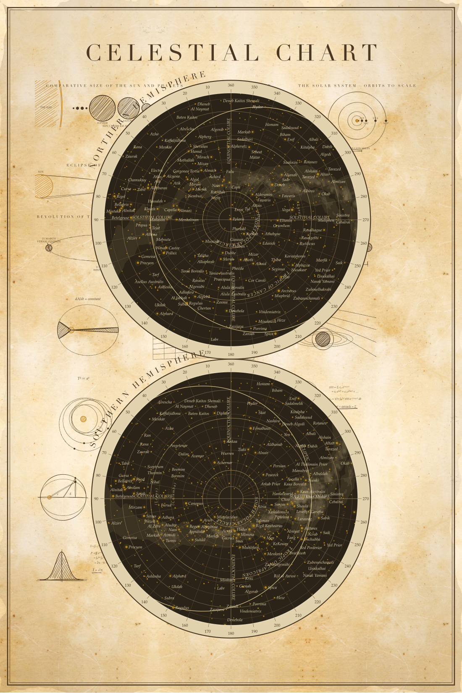

# StarChart

A vintage celestial chart, generated from real catalogue data as print-ready
SVG. It reproduces the Cavallini "Celestial Chart" puzzle — with the two
hemispheres **stacked vertically** rather than printed side by side — and can
mark a specific moment in time.



## Running it

```sh
npm install          # jsdom, for the headless editor test
npm run dev          # serves the editor at http://127.0.0.1:8888
```

No build step and no backend. The renderer is plain ES modules; `npm install`
is only for the test harness.

## Using it on a website

The renderer is also a dependency-free ES module. Jekyll, plain HTML, anything
static — copy `web/starchart/` in and import it. No build step, no npm.

```html
<script type="module">
  import { renderChart } from '/starchart/index.js';
  document.querySelector('#chart').innerHTML =
    await renderChart({ base: '/starchart' });
</script>
```

`renderChart` takes config overrides for the date, place and layout; `loadChart`
returns the pieces separately if you want to drive it yourself, as the editor
does. A full chart renders in about 35 ms.

The browser build ships **132 KB gzipped** of catalogue data — the upstream
d3-celestial files trimmed to the fields actually read and rounded to the
precision a poster resolves, down from 410 KB. Rebuild it with
`npm run build-data` after changing the upstream catalogues.

Ephemeris comes from [astronomy-engine](https://github.com/cosinekitty/astronomy)
(MIT, 116 KB, no data files) rather than Skyfield's 16 MB JPL kernel. Asked for
the same J2000 frame as the star catalogue, the two agree to 0.004° — about
0.006 mm on the plate.

## The editor

A static page for arranging the poster, picking colours, switching features on
and off, sliding the time across the day, and downloading the result as SVG.

It is a thin shell over the module — the same code a website imports — so the
editor is also the proof that the library runs in a browser. There is no
backend; the only reason a server is involved at all is that browsers refuse to
`fetch` from `file://`.

Two update paths, deliberately. Colours and weights rewrite the chart's embedded
stylesheet in place, which is instant. Anything that moves geometry re-renders,
which measures about 35 ms.

### Arranging the poster

**Hold shift.** It outlines every movable thing — the plates, the seventeen
diagrams, the title, the caption — and arms dragging. Let go and dragging pans
again. Layout editing is modal on purpose: without it every drag near a plate is
a coin toss between moving the poster and moving the view, and the grabbable
regions are invisible.

**The outline is the hit area.** Drag from anywhere inside it. That matters
because the diagrams are mostly empty space — hit-testing their own shapes meant
only the one whose artwork filled its box could be grabbed. Which object a click
lands on is decided by area, smallest box first, so overlapping objects stay
reachable: the large one underneath is still clickable everywhere the small one
is not.

**Drag the corner grip to scale.** Aspect stays locked and the opposite corner
stays put. A diagram scales its box; the plates scale radius and gap together so
the pair stays in register; the title and caption scale their type, since text
has no box of its own.

**Shift-click selects**, and the sidebar narrows to that object — its position
and size, the features it contains, the colours it uses. **← All controls**
brings the full panel back.

**The first thing you arrange pins everything else.** The diagram bands hang off
the lower plate, so moving or scaling the plates used to carry every diagram
with them. Now any manual change freezes whatever is still following the
computed arrangement. Overlap is allowed. **Reset layout** restores both kinds
of layout change — dragged positions and the numbers behind them.

### Printed size

**Calibrate** opens a panel with a bar of a fixed pixel width. Hold a ruler
against it, say how long it really is in mm, cm or inches, and **Done** closes
the panel and scales the view so a millimetre on screen is a millimetre on
paper. The button then lights, and goes out the moment you zoom away — the light
means "this is life size now", not "you calibrated at some point".

A browser cannot know how large its pixels are: CSS treats an inch as 96 px
whatever the display does, so the nominal figure is out by 10–30% on most
hardware. The measurement is remembered.

Two details the arithmetic depends on. The bar is a fixed number of *pixels*,
not of millimetres — sizing it in millimetres drew it through the very
assumption being calibrated, so each correction moved the ruler as well as the
thing measured, and repeating one reading walked the scale away instead of
converging. And it is as long as the window allows, because the error in reading
a ruler is roughly constant however carefully you squint, so a longer bar makes
that error a smaller fraction of the result.

### The default sheet

The plates fill the column the title and caption leave, centred, with equal
clearance above and below and their rims touching — 24 × 36 inches, a radius of
172 mm. Switch **Fill the sheet between title and caption** off to set a radius
and offset by hand; sizing the plates by their grip does that for you, since
otherwise the radius is derived and the drag would do nothing.

The diagrams start switched off, because with the plates filling the sheet they
land on top of them. **Layout → Diagrams → Show the diagrams** brings them back,
to be dragged wherever you want.

Each is drawn at its own size and they flow across the sheet, wrapping — the
eclipses long and low because they are a row of bodies on a line, the moon wheel
square because it is a circle, the size comparison wide because it is a queue of
planets. Nothing is resized to dodge a collision: a diagram squeezed into a
leftover gap reads worse than one sitting on top of something, and anything can
be dragged or scaled afterwards.

Each diagram is styled on its own. Selecting one seeds it a copy of the shared
defaults, after which its palette, heading, captions and the rule above its
heading are independent — including whether that rule is drawn at all. The
overrides are emitted as CSS scoped to the diagram's id, which wins on
specificity without duplicating the base rules.

## How it works

**The projection is azimuthal equidistant, centred on the celestial poles**
(`web/starchart/projection.js`). Distance from the centre is linear in angular
distance, `r = R·z/z_max`, so declination rings come out evenly spaced — that
even spacing is what gives the original its ruled, instrument-like grid.

This is deliberately *not* the stereographic projection that star-map generators
normally use. Those centre the map on the observer's zenith and clip at the
horizon, so the map **is** a view: change the hour and you get a different
picture. This chart maps the whole celestial sphere and takes no date, time, or
latitude at all. Both circles reach a little past the celestial equator, so they
overlap — as the original does, which carries Virgo and Sextans on both.

**Time therefore enters as an overlay, not as a projection setting.** The fixed
stars don't move on a human timescale: precession is about 1° per 72 years, and
the fastest proper motion in the sky is ~10 arcseconds a year — both far below
what a poster can show. What *is* specific to a date are the planets, Sun, and
Moon, and which part of the sphere was above the horizon at a given place. Those
are drawn on top of a plate that is otherwise unchanging.

**There are no constellation figure lines**, because the original has none. It
carries names in curved italic over a bare star field, and that restraint is a
large part of the look.

**Curved lettering places one glyph at a time** (`web/starchart/lettering.js`)
rather than using SVG `<textPath>`. librsvg — which backs a lot of SVG tooling —
silently drops `textPath`, which would mean labels vanishing with no error.

### Layout

```
web/starchart/    the library — ES modules, no build step
  projection.js   azimuthal equidistant, N and S hemispheres
  horizon.js      the observer's horizon as a computed curve
  bodies.js       Sun and Moon: positions, day circles, phase
  reference.js    ecliptic, tropics, polar circles, colures
  labels.js       collision-avoiding label placement
  lettering.js    text set along an arc, glyph by glyph
  sketch.js       drawing a line the way a hand would
  panels.js       the seventeen diagrams, and the pen they draw through
  overlay.js      the date-and-place overlay
  style.js        the stylesheet embedded in the SVG
  svg.js          minimal SVG writer
  render.js       assembly
  config.js       what to draw
  themes/         how it looks — portolan.js, cavallini.js
  data/           trimmed catalogues, built by scripts/build-data.mjs
  vendor/         astronomy-engine (MIT)
web/              the editor: index.html, app.js, style.css
scripts/          build-data, dev server, rebaseline
data/d3-celestial/  upstream catalogues (BSD-3, see NOTICE)
```

### Sheets and palettes

A **sheet** is the whole design: how much of a hand it is drawn with, whether
the paper has tooth, the line weights, the type sizes. A **palette** is only
colour. Between the two sheets that ship, 44 colours differ and so do ten other
values — `panels.hand` among them — which is why swapping sheets does more than
repaint.

`portolan.js` is ink on aged parchment, drawn by hand. `cavallini.js` is the
printed lithograph the project started from: pale sage, petrol blue, and every
line ruled. Palettes can be saved from whatever colours are on screen; a palette
is every colour-valued leaf in a theme, gathered automatically rather than
listed by hand, so a colour added later is captured without anyone remembering.

### The paper

Two public-domain paper scans, embedded and mirror-tiled. This was simulated for
a while — turbulence at several scales mapped into the alpha of two browns — and
it was a decent imitation that still read as one. Ageing is the accumulated
history of a physical object, and the honest way to have it is to photograph
paper that already has it.

Mirroring makes any tile seamless without touching a pixel, at the cost of a
symmetry that is itself readable, so a second scan sits underneath at a
different size and turned ninety degrees. The two tile sizes share no factor, so
their seams never line up anywhere on the sheet.

Both scans are cropped hard, because a scan's own edges are where its artefacts
live. The first crop kept a band of faint ribbing down one side of one of them,
and mirroring turned that into a ladder of marks running straight down the
sheet, once per tile. The second scan is deliberately featureless for the same
reason: an under-layer with any incident in it announces the tiling.

Edge darkening still sits on top, with a torn boundary — a gradient pushed
around by turbulence, which is safe on a gradient in a way it would not be on
line work, since there is no edge to smear. It has to be painted past the sheet,
or the displacement samples transparency from outside and leaves a hard band.

### Drawing by hand

Above `hand: 0` the diagrams stop being ruled. Lines bow and are gone over
twice; circles wobble on a few sine terms at random phase, because a hand drifts
smoothly and per-point noise looks like a machine imitating one; and filled
shapes become an outline with hatching inside. That last one carries most of it
— wobbling the outline of a flat fill just gives a wobbly flat fill, and flat
fill is most of what reads as machine-made.

The randomness is seeded from each shape's own coordinates, so the same chart
drawn twice is identical byte for byte. Unseeded, nudging a slider would
reshuffle every line on the sheet.

It is all ordinary path data — no filters, no raster — so it prints at whatever
resolution the printer has. A displacement filter would have been ten lines
instead of a module, and would have rasterised the poster and wobbled the type
along with everything else.

## Tests

```sh
npm test
```

Property tests check the geometry against facts that hold independently of this
code: known star positions, the even ring spacing that makes the projection
equidistant, the horizon sitting at altitude zero and ninety degrees from the
zenith, the Sun and Moon against Skyfield's values for the configured instant.
Then a golden snapshot guards the whole rendered document, and a headless run of
the editor drives the real shipped module in jsdom.

The snapshot was taken while a second, independent Python implementation still
existed, and was verified against it element by element — 7,586 elements and
108,556 numbers agreeing to 0.002 mm. That comparison is what the fixture
carries forward. Rebaseline an intended change with `npm run rebaseline`, after
looking at the chart.

## Status

Working: projection, star field by magnitude class, Milky Way, graticule, rim
degree scale, curved hemisphere labels, tropics and polar circles, the ecliptic
and colures, star and constellation names with collision avoidance, the
date/place overlay, and the editor.

The Sun and Moon are plotted for the configured instant, each with the circle it
traced that day. That day circle is the body's circle of constant declination:
over a single day the Earth's rotation carries it round the pole at a fixed
declination, so on this projection the path is exactly concentric with the
plate's centre. Where it crosses the horizon curve is where the body rose and
set. The Moon also carries its month-long path against the stars, which shows
the roughly five-degree tilt of its orbit against the ecliptic.

All seven diagrams from the original are drawn around the plates: comparative
sizes of the Sun and planets, the magnitude key, the solar system to scale, both
eclipses, Earth's revolution, and the illumination of the Moon. Five more are
not from the original and carry no captions, only their notation — Newtonian
gravitation as nested inverse-square field lines, Kepler's equal areas, a
spacetime grid drawn down into a well, light bending past a black hole, and the
Kuiper belt's eccentric orbits. Five more again are pages of working, set for
the empty bands beside the plates, and every one of them is about the sky rather
than merely near it: Euler's formula over the unit circle it is a statement
about, epicycles, Kepler's equation, the spherical law of cosines, and the
Gaussian integral. They are generated from real figures rather
than traced — the planets are to true
relative size and true relative orbital distance, and the Moon phases are
geometric. The eclipse diagrams are schematic in their proportions, because at
true scale the Sun would be four hundred times further away than the panel is
wide, but the construction is honest: the Moon is placed so its umbra converges
exactly on the Earth's surface, which is the fact the panel exists to show.

The added five are held to the same standard. The two Kepler sectors are solved
by bisection to be genuinely equal in area, since a drawing where they visibly
are not makes the opposite claim to the intended one. The orbits are drawn with
the real semi-minor axis and scaled by aphelion distance, so nothing runs off
its panel. The light deflection is scaled *down*: at impact parameters small
enough to fit beside the horizon, 4GM/c²b asks for a bend of over a hundred
degrees, which is far outside where that formula holds. The factor buys a
legible angle, and the asymmetric shape — straight on the way in, leaving at
the deflection angle — is the one the geometry actually has.

The five pages of working are drawn the same way. Euler's construction is the
formula's own content: the radius is the hypotenuse, and its two legs are the
cosine on the real axis and the sine up the imaginary one. The epicycle panel is
not an analogy — a sum of terms `c_n e^(inωt)` *is* a circle riding a circle,
which is the Ptolemaic drawing in modern notation, and the loops in the traced
path are the retrograde motion that construction exists to explain. Kepler's
equation gets the auxiliary circle, because the eccentric anomaly is an angle on
that circle and not on the ellipse, which is the whole reason it is drawn. The
spherical triangle is the one this chart computes its own horizon with: pole,
zenith, star, and the law of cosines on it reduces to `sin h = sin φ sin δ +
cos φ cos δ cos H` — set `h = 0` and that is the curve on the plates above. Its
arcs are slerped and projected rather than drawn as straight lines, because on a
triangle that open the difference is plainly visible. The Gaussian integral is
the loosest tie of the five and is here as a piece of working: its curve is the
sampled `e^(−x²)` rather than a drawn bell, since the area under *that* function
is the quantity the page computes.

The notation is set by a small routine that lays lines out left-aligned but not
flush — each nudged sideways, dropped a hair off its baseline and rotated a
fraction of a degree, seeded from the block's own position so it never
reshuffles between renders. That irregularity is most of the difference between
a page of working and a table of results.

Next: planets plotted on the plates themselves.

## Data

Catalogues are from [d3-celestial](https://github.com/ofrohn/d3-celestial)
(BSD-3-Clause, Olaf Frohn). See [NOTICE](NOTICE) for full attribution.
